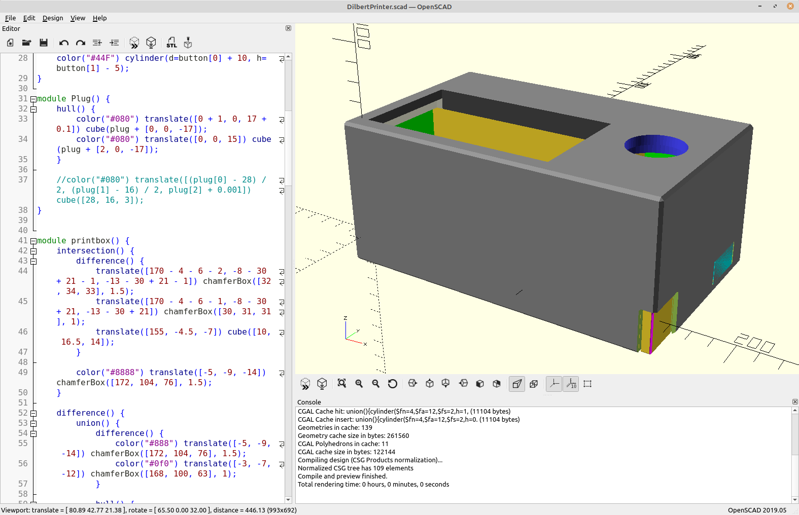

# Pibert

Dilbert comic printer for Raspberry Pi

## Printer setup

Makes use of the thermal printer ZJ-58.
A tutorial on the setup of the printer can be found on [Adafruit](https://learn.adafruit.com/instant-camera-using-raspberry-pi-and-thermal-printer/system-setup).

## Software setup

### Prerequisites

Required libaries and Python packages are installed via

```bash
sudo apt install python3-pip libopenjp2-7 libtiff5
sudo pip3 install Pillow
```

### Clone project

```bash
git clone https://github.com/mrkskwsnck/Pibert.git $HOME/Pibert
```

### Systemd setup

User specific _systemd_ setup is not easy for sure :-(

```bash
# Create user specific systemd folder
mkdir $HOME/.config/systemd/user

# Link service and timer files
ln -s $HOME/Pibert/dilbert_today.service $HOME/.config/systemd/user
ln -s $HOME/Pibert/dilbert_today.timer $HOME/.config/systemd/user

# Reload user specific systemd units
systemctl --user daemon-reload

# Enable and start timers
systemctl --user enable dilbert_today.timer
systemctl --user start dilbert_today.timer
systemctl --user enable dilbert_random.timer
systemctl --user start dilbert_random.timer

# Enable and start daemon for the arcade button
systemctl --user enable dilbert_daemon.service
systemctl --user start dilbert_daemon.service

# Make sure the timer runs while the user is not logged in
sudo loginctl enable-linger $USER
```

## Case

The 3D printable case is intended for use with Raspberry Pi Model B (from 2012).


